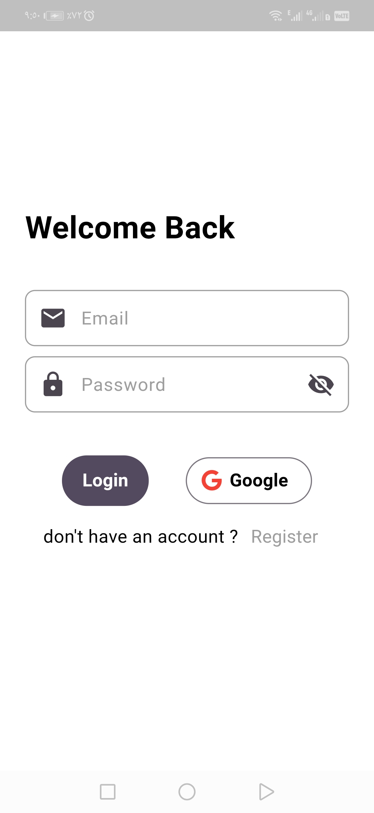
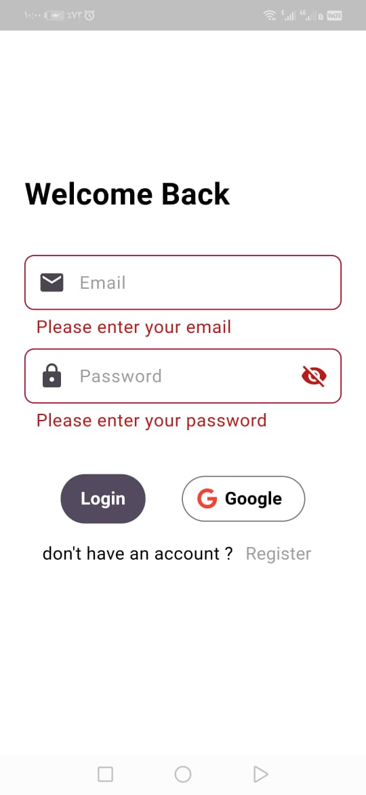
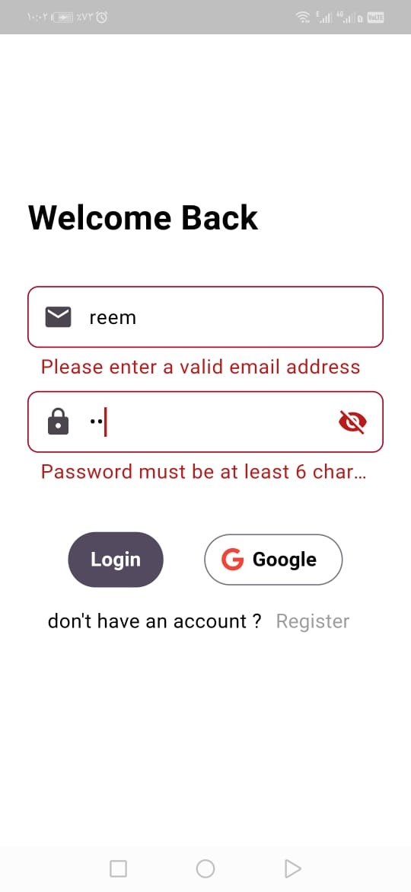
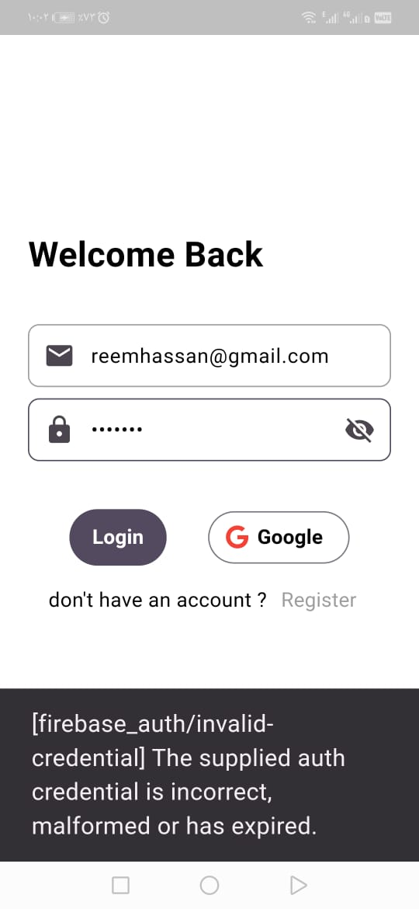
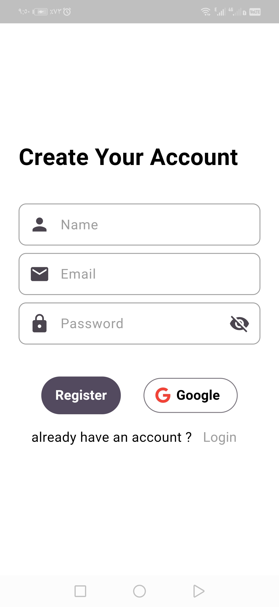
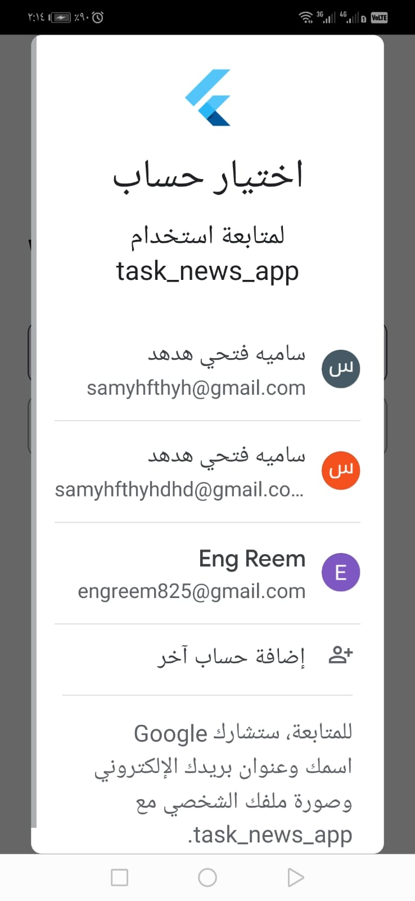
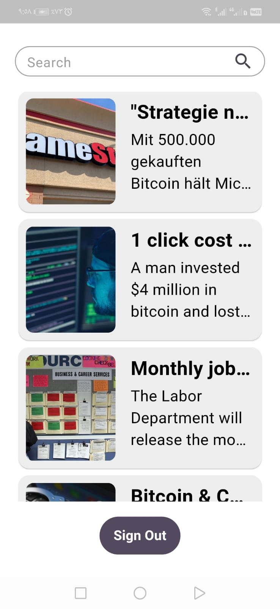
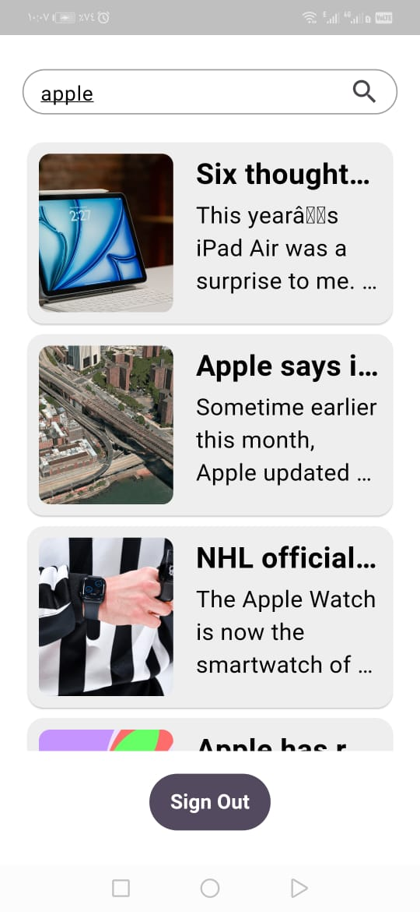

# task_news_app

A responsive Flutter app that fetches news articles from an free API, allows users to search for articles and includes authentication via Firebase (Email/Password & Google Sign-In). The app follows Clean Architecture, uses Riverpod for state management, and is fully responsive.

# Setup Instructions

- Clone the Repository
git clone https://github.com/ReemHassan578/task-news-app.git
cd task-news-app

- Install Dependencies
flutter pub get

- Add API Key
This project requires an API key to fetch news articles. Create a .env file in the root directory and add
API_KEY=your_api_key_here. Free apiKey is get from https://newsapi.org/

- Firebase Setup
This project uses Firebase for authentication using Google or Email/Password. Since Firebase configuration files are not included for security reasons, follow these steps:
  - Go to Firebase Console
  - Create a Firebase project
  - Configure flutter app
  - Enable Email/Password, Google Sign-In Authentication in Firebase Authentication settings
  - Add the SHA-1 and SHA-256 fingerprints for Google Sign-In (Android)

- Run the App
flutter run

# core folder contains

- dependency injection file which is responsible for providing and managing dependencies efficiently.
- theming folder for app's colors and text styles
- shared widgets
- routing folder to define app routes and method of generating routes
- networking folder to create dio helper, handle api errors and create api result class

# Features 

# Authentication :
- using riverpod to manages the user's authentication, stores and updates the user's authentication status and listens for changes in user state (e.g., sign in with email/password - Google , register new user  or sign out)

# login screen

## login screen UI

## app validation

## firebase backend validation

# register screen

## register screen UI

## google sign in 

# Home :

- data layer contains home api service that fetches news from free news Api, models that represents response of that api call and home repo that return the result indicating either a successful api call or a failure 

- domain layer contains article entity which will be used in the UI

- presentation layer contains home Screen with an articles provider that manages fetching all articles or searching for a certain topic. Searching is handled using debounce to prevent redundant API calls and reduce server load.

## home screen UI

# search feature

[demo_video](https://drive.google.com/file/d/1uIS-ficFFvS_ttLtZaUeY2sOF1vGQP2i/view?usp=drive_link)